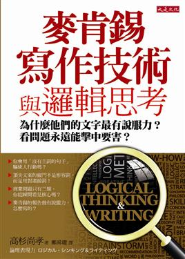

##書籍

書樣  | 書籍資料
------------- | -------------
  | 書名：麥肯錫寫作技術與邏輯思考    作者：高杉尚孝    譯者：鄭舜瓏    出版社：大是文化

 
##目錄
####前言

####第１章　訊息——我未必這麼說，但能使你這麼做

####第２章　寫出流暢有力的文案——主詞．接續語．具體性，三大重點

####第３章　你的思想，如何以精彩文書表現？──表現思考的技巧，你能運用自如嗎？

####第４章　解決問題的基本能力──這一章，迅速提升你的做事能力

####第５章　有說服力的故事，如何展開──你會說「商業用」的故事嗎？

####第６章　金字塔結構，如何轉成報告和簡報──展現你邏輯說服力的故事，得這樣說……

####第７章　提案與文案的高明說服技巧──邏輯思考，加上心理學技巧，說服人心不必口才犀利
