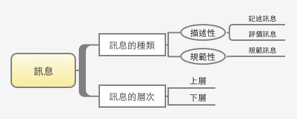

#訊息

訊息是構成文書必要的「零件」。
而只要是構成商業文書或一般文章的所有文書，都可以視為訊息。換句話說，可以把製作文書當成是在組合訊息零件。



## 訊息種類 
###一篇文書構成的成分大致區分成兩大類：「描述」和「規範」。  

描述性的訊息，是表示事務的狀態。  
規範性的訊息，則是表示事物應該有的狀態、或者人該採取怎樣的行動。  
其中，描述性的訊息還可以再區分為「記述」和「評價」。


| 種類  			| 說明 				  		| 範例                      |
|:-------------: |:---------------:		| :-------------:          |
| 記述訊息      	| 描述了事務的情況和現象本身 |  這個寶特瓶的容量為500毫升  |
| 評價訊息     	| 表達某一情況或現象的好壞   |  這個寶特瓶真漂亮         |
| 規範訊息	 		| 要求事務應有的狀態、<br />或者人該採取怎樣的行動  |  這個寶特瓶應該要有500毫升 <br/>（假設此寶特瓶目前只有480毫升）|


####### 傳遞訊息時的轉變
###把「記述訊息」傳遞成「評價訊息」：  
記述與評價之間，存在著連結兩者的“評價項目”與“評價基準” (*註1*)(*註2*)。  
如果把記述訊息當做「根據」，且把評價訊息當作「結論」，那麼就會出現把根據與結論連起來的“評價項目”與“評價基準”。
<br/>

###把「評價訊息」傳遞成「規範訊息」。
當遇到問題時，幾乎所有人都會覺得應該要解決問題，因此大家會把原本的評價訊息連結到規範訊息。而此狀況稱之為「行動原理」。
連結順序如下：  
1.「OO是必要的」(必要的屬於「評價訊息」)  
2.「缺乏必要的OO，是一個大問題」  
3.「應該解決問題」  
4.「應該取得必要的OO」 (應該取得則屬於「規範訊息」)


<br/>
## 訊息層次
在整份文書當中，訊息可分為上層和下層訊息，上下層訊息為金字塔結構的概念。  
例如，一份文書是由「主旨」、「章節」、「段落」、「短文」等組成。那麼「主旨」就是「章節」的上層訊息，而「章節」就是「主旨」的下層訊息；相同的「章節」是「段落」的上層訊息，而「段落」則是「章節」的下層訊息。


<br/>
## 傳遞訊息的順序，讓對方完整理解你所傳遞的訊息
傳遞何種訊息給對方，是促成對方理解的重要因素。由於有時傳遞訊息者與接收訊息者兩者所認知的訊息種類不相同，因此必須注意接收者認知的訊息，是否為自己真正想要傳遞訊息的種類，因而看情況需要進一步加以說明。  

因此，如果你還不了解對方，最好是依序傳達記述訊息、評價訊息、規範訊息，大致上就不會出錯。最重要的是，要依照不同的接收者，思考如何分別運用訊息的種類。

#####傳遞順序與方法：
```
step1. 利用記述訊息描述內容，再加入適當的說明，解釋訊息中的專有名詞或詞彙。  
step2. 當對方瞭解記述內容後，那麼他會期待接下來的評價訊息。因此可直接表達評價訊息；或者利用“評價項目”與“評價基準”，把「記述訊息」傳遞成「評價訊息」。  
step3. 當對方接收完評價訊息之後，會期待接下來出現的規範訊息。因此可直接建議對方應該怎麼做；或利用“行動原理”，把「評價訊息」傳遞成「規範訊息」促使對方行動。
```

<br/>

<br/><br/>    
  
## 註釋
註1：評價項目，決定該事務是好或壞的項目，通常有多個項目。  
註2：評價基準，決定評價項目是好或壞的一個基準值。

<br/>
## 書籍參考
書名：麥肯錫寫作技術與邏輯思考  
章節：第一章 - 訊息   
作者：高杉尚孝   
譯者：鄭舜瓏   
出版社：大是文化

